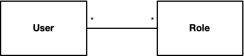

# Leitstand User Repository

The _Leitstand User Repository_ allows to maintain users for a standalone Leitstand installation.
It is mainly intended for environments where an integration with an enterprise identity management is not available.

## Overview

The _Leitstand User Repository_ maintains user profiles and their respective roles.

 

Each user can have many roles.
A role can be assigned to multiple users.

## User Profile

The user profile consists of

- a unique user account ID in UUIDv4 format
- a unique user name, which is used to login to Leitstand
- the user's email address
- the user's first and last name
- the assigned roles

The user account ID is bound to the account lifecycle and cannot be changed.

Passwords are stored as salted hash values using [PBKDF2](https://en.wikipedia.org/wiki/PBKDF2).
The applied number of iterations for the hash computation is stored in the user entity, which allows to increase the number of iterations if needed. Salt and password hash are stored Base64-encoded.

## Role

A role consists of a unique name and an optional description.
Each Leitstand module can define additional roles to protect its REST API endpoints.
All roles are pre-defined. 
It is not supported to create new roles at runtime.

